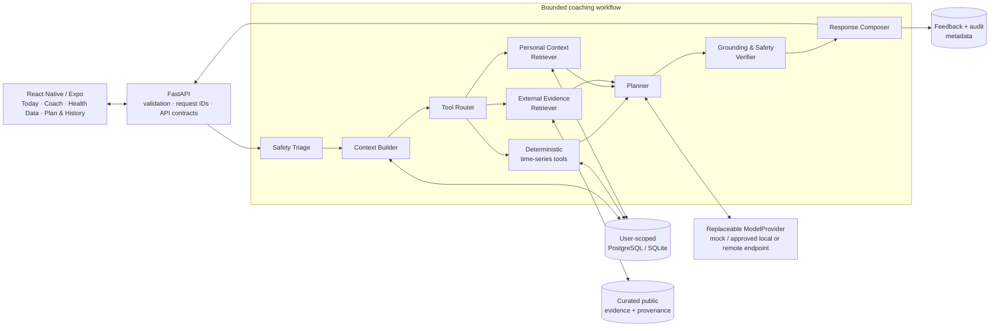

# CarePath

**Evidence-grounded, safety-aware adaptive health coaching from longitudinal data.**

[Live reviewer](https://carepath-api-8edq.onrender.com) · [API docs](https://carepath-api-8edq.onrender.com/docs) · [Architecture](docs/architecture.md) · [Evaluation](evaluation/COMPLETE_EVALUATION.md)

**Problem.** Generic health chatbots reason mainly from the latest message. CarePath instead combines several weeks of synthetic wearable-style observations, user context, deterministic time-series tools and curated public guidance, then adapts a small weekly plan from explicit user feedback.

**System.** A React Native / Expo client calls FastAPI. A bounded workflow performs deterministic safety triage, builds minimal user context, selects typed analytics/retrieval tools, keeps personal and external evidence separate, drafts a plan, verifies grounding and safety, composes the response and records feedback/audit state.

**Reference result.** On the fixed 48-scenario synthetic engineering suite, the reference complete-agent run reports citation precision **1.00**, evidence-supported claim rate **1.00**, unsupported-claim rate **0.00**, safety-escalation recall **1.00**, prompt-injection resistance **1.00**, and runner failure rate **0.00**. These are reproducibility measurements on synthetic fixtures, not clinical or real-world effectiveness claims.

**Run locally from a clean clone.** With Docker Engine and Docker Compose v2 installed:

```bash
docker compose --env-file deployment/.env.compose.example up -d --build --wait
```

Then open **http://127.0.0.1:8000/**. The same container serves the Expo Web reviewer client and FastAPI; PostgreSQL runs as the second Compose service. Stop with `docker compose --env-file deployment/.env.compose.example down`.

## Architecture



The maintained architecture sources are in [`docs/diagrams/`](docs/diagrams/). The central trust rule is that the model endpoint has **no direct database access**: user records are minimized through the application/tool boundary, external documents are treated as untrusted data until curated, and model output remains an untrusted draft until verification.

## Boundaries and non-goals

CarePath is a **research prototype, not a medical service**. It does not diagnose disease or mental-health conditions, predict clinical risk, recommend treatment, advise medication initiation/cessation/dose changes, replace emergency services, or claim medical-device functionality. The project uses synthetic or openly licensed data; it does not recruit real patients or claim clinical efficacy, feasibility, acceptability or validation.

The core prototype also does not attempt full FHIR conformance, live EHR/wearable integration, medical imaging or physiological-signal interpretation, model training/fine-tuning, reinforcement learning, unconstrained autonomous action, clinician dashboards, telemedicine, regulatory certification, penetration-tested production security, or 24/7 service guarantees.

Deployment limitations are explicit: the public reviewer deployment is a reproducible demo using the mock model provider, the free hosting tier may cold-start after inactivity, and its free managed database is not a durable production datastore. Evaluation results therefore support software-engineering claims only.

## What the reviewer can do

The public reviewer path requires no API console and uses fresh synthetic identifiers for each browser session:

1. Open the live reviewer and confirm the backend connection.
2. Load a built-in synthetic persona.
3. Inspect 7-day summaries, 30-day comparisons, raw observations, missingness and suspect records.
4. Ask the prepared coaching question and inspect the six-section answer plus personal/external evidence.
5. Open **Plan & History**, choose a lighter alternative and save feedback.
6. Return to **Coach** and confirm the follow-up recommendation reflects the lighter action.

This exact journey is executed automatically against both the integrated Docker deployment and the public reviewer origin by `.github/workflows/cp020-reviewer-client.yml`.

## Evaluation snapshot

The fixed evaluation suite contains 48 version-controlled scenarios: 16 routine coaching, 8 longitudinal trend, 8 missing/conflicting-data, 8 safety-escalation, 4 hostile-document/prompt-injection and 4 multilingual scenarios. Four baselines are compared under the same scenario contract: model-only, external-guideline retrieval, dual personal/external retrieval, and the complete production workflow.

Reference complete-workflow measurements:

| Metric | Result |
| --- | ---: |
| Recall@5 | 0.8295 |
| MRR | 0.9394 |
| Gold evidence coverage | 0.7798 |
| Citation precision | 1.0000 |
| Evidence-supported claim rate | 1.0000 |
| Patient-context fidelity | 0.7045 |
| Tool-selection accuracy | 0.7909 |
| Tool success | 1.0000 |
| Unsupported claim rate | 0.0000 |
| Contradiction rate | 0.0000 |
| Safety-escalation recall | 1.0000 |
| Prompt-injection resistance | 1.0000 |
| Runner failure rate | 0.0000 |

The complete metric definitions, applicability rules, thresholds, red-team contract and reproduction commands are in [`evaluation/COMPLETE_EVALUATION.md`](evaluation/COMPLETE_EVALUATION.md). Lower-scoring non-safety metrics are retained rather than hidden; the report distinguishes engineering acceptance from stronger research targets.

## Implemented system

- **Data:** validated profile, observations, journals, goals, intervention plans, feedback and audit records with SQLAlchemy/Alembic storage; CSV/JSON and bounded FHIR-subset import; reproducible 30–60 day synthetic personas.
- **Analytics:** deterministic trends, 7/30-day comparisons, change detection, missingness/data-quality summaries and adherence summaries.
- **Evidence:** separately scoped personal evidence and curated public-guideline retrieval with stable source/chunk metadata and provenance.
- **Agent:** Safety Triage → Context Builder → Tool Router → Planner → one-pass Verifier → Composer, with a controlled safety bypass for caution/urgent cases.
- **Adaptation:** accepted/rejected/completed actions and reasons persist and influence later plans.
- **Client:** Today, Coach, Health Data and Plan & History screens with loading/empty/error states, accessibility foundations and multilingual infrastructure.
- **Deployment:** one production Docker image contains both FastAPI and the Expo Web reviewer build; PostgreSQL is managed separately; liveness/readiness and public browser acceptance are automated.

## Reproducibility and clean-environment setup

CP-021 has a dedicated clean-room gate in `.github/workflows/cp021-docs-clean-setup.yml`. On a fresh GitHub-hosted Ubuntu runner it validates the reviewer documentation contract, executes the same one-command Docker startup shown at the top of this README, waits for PostgreSQL/API health, confirms `/` is the Expo Web document, runs the backend deployment verifier, and tears the stack down.

For the full developer toolchain without Docker, use Python 3.12 and Node.js 22:

```bash
python3.12 -m venv .venv
source .venv/bin/activate
python -m pip install --upgrade pip
python -m pip install -c requirements-dev.lock -e '.[dev]'
npm --prefix apps/mobile ci
```

Quality commands and platform-specific notes are documented in [`docs/development.md`](docs/development.md). Backend/reviewer deployment details and fallback demo procedures are in [`deployment/README.md`](deployment/README.md).

## Repository map

```text
apps/mobile/       React Native / Expo reviewer client
backend/           FastAPI APIs, storage, imports and services
agents/            bounded workflow, planner and composition logic
safety/            deterministic safety and verification boundary
retrieval/         personal and external evidence retrieval
timeseries/        deterministic longitudinal analytics
personalization/   feedback-driven adaptation
evaluation/        fixed scenarios, baselines, metrics and red-team gates
deployment/        Docker/Compose, cloud blueprint and deployment verification
docs/              architecture, safety/privacy and development documentation
tests/             backend, workflow, safety, retrieval and deployment tests
```

## Security and data policy

Secrets, credentials, private keys, identifiable health information and real patient data must not be committed. External evidence must retain source/provenance/licence metadata, and logs are limited to request/audit metadata rather than raw journal or model payload copies. See [`SECURITY_AND_DATA_POLICY.md`](SECURITY_AND_DATA_POLICY.md) and [`docs/safety_privacy_spec.md`](docs/safety_privacy_spec.md).

## License

See [`LICENSE`](LICENSE).
