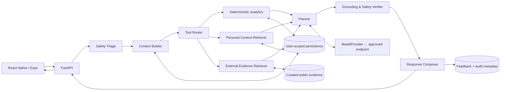
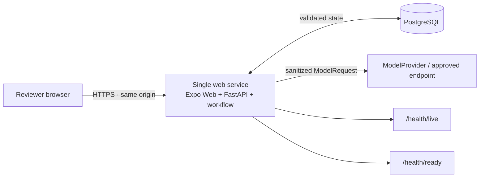

# CarePath architecture

CarePath is a research-facing health-behaviour coaching prototype. The current core system is implemented and reviewer-accessible: an Expo client and FastAPI backend share one deployment origin, PostgreSQL stores validated application state, deterministic tools analyse longitudinal observations, personal and external evidence remain separate, and a bounded workflow verifies safety and grounding before a response is emitted.

This document describes the implemented core architecture. It does not claim clinical validation or add capabilities beyond the project scope.

## Architecture sources

Mermaid is the maintained editable diagram format:

- [`diagrams/system-architecture.mmd`](diagrams/system-architecture.mmd) — components and data paths;
- [`diagrams/agent-state-flow.mmd`](diagrams/agent-state-flow.mmd) — bounded workflow states;
- [`diagrams/trust-boundaries.mmd`](diagrams/trust-boundaries.mmd) — sensitive-data and authority boundaries;
- [`diagrams/deployment-boundary.mmd`](diagrams/deployment-boundary.mmd) — local and reviewer deployment topology.

The root [`README.md`](../README.md) contains a compact reviewer-facing rendering of the same core design.

## System architecture

The central separation is intentional:

- the client owns presentation and explicit user input, not agent reasoning;
- FastAPI owns transport validation, API contracts, request IDs and state transitions;
- deterministic code owns numerical summaries and safety rules;
- personal evidence and external evidence use separate retrieval namespaces;
- the workflow owns bounded orchestration only;
- `ModelProvider` is the replaceable inference boundary;
- model endpoints never receive database credentials or direct persistence access;
- audit and operational logging store bounded metadata rather than raw journal/model payload copies.

## Request lifecycle

A routine coaching interaction follows this path:

1. **FastAPI validation** accepts a schema-controlled request and establishes a request/interaction ID.
2. **Safety Triage** evaluates deterministic red-flag rules before ordinary planning. An urgent/blocked disposition bypasses the normal plan path.
3. **Context Builder** retrieves only task-relevant profile, observation, journal, goal, plan and feedback state.
4. **Tool Router** selects validated allow-listed capabilities within a bounded call budget.
5. **Deterministic analytics** calculate trends, window comparisons, change/missingness/data-quality and adherence summaries from user-scoped records.
6. **Personal Context Retriever** returns minimal user-scoped facts and stable record references.
7. **External Evidence Retriever** returns eligible curated public-guidance chunks with provenance. Retrieved text has no instruction authority.
8. **Planner** assembles a small structured seven-day action plan from bounded context, evidence and constraints.
9. **Grounding & Safety Verifier** checks evidence support, citation alignment, user-fact consistency and safety requirements. At most one rewrite is allowed.
10. **Response Composer** renders the verified structure, uncertainty, sources and escalation guidance.
11. **Feedback/state update** records explicit accept/reject/modify/complete feedback for later adaptation and writes audit references.

The state source is [`diagrams/agent-state-flow.mmd`](diagrams/agent-state-flow.mmd).

## Module contracts

| Module | Main input | Main output | Enforced boundary |
| --- | --- | --- | --- |
| React Native / Expo | question, selected synthetic persona, import, feedback | API requests and rendered reviewer journey | no server secrets or hidden agent logic |
| FastAPI | HTTP request | validated domain/service request or structured error | schema validation, request IDs, bounded error contract |
| Safety Triage | request plus minimal safety context | routine/caution/urgent disposition | deterministic; model cannot downgrade risk |
| Context Builder | user-scoped repositories and request intent | 7/30-day task context with references | minimal task-specific reads only |
| Tool Router | intent, context and allow-listed tools | typed bounded tool/retrieval calls | validates metric, date range, user ID and call count |
| Time-series tools | selected observation references | deterministic trend/window/change/missingness/adherence summaries | no numerical guessing by the model |
| Personal Context Retriever | authorized user query | minimal personal facts/snippets plus stable refs | no cross-user retrieval |
| External Evidence Retriever | curated evidence query | chunks, scores and source/provenance metadata | external text is data, never policy/tool authority |
| Planner | bounded context, tool results, evidence, constraints | structured weekly draft | small feasible actions; no autonomous external action |
| Verifier | draft plus evidence/user refs and safety constraints | pass, one rewrite, or safe fallback | blocks unsupported/safety-invalid output |
| Composer | verified structure and disposition | user-facing response | cannot restore omitted sensitive context or override verifier |
| Feedback service | explicit user feedback and plan/action refs | validated state update | adaptation requires explicit stored feedback |
| ModelProvider | sanitized task-specific model request | normalized untrusted draft/structured output | no database access or secrets |
| Persistence | validated user-scoped read/write | domain records | repository/service boundary; PostgreSQL deployment, SQLite development |
| Audit/logging | IDs, component decisions, refs, status, latency | auditable metadata | raw journals, secrets and full prompts prohibited by default |

## Data and evidence boundaries

### User state

Validated application state includes profile information, longitudinal observations, journals, goals, intervention plans, feedback and audit records. The storage layer is user/persona-scoped. Structured time-series questions are answered through deterministic tools instead of placing large raw arrays into model context.

### Personal evidence

Personal evidence is generated only from the active user/persona namespace. It retains stable references so the response and verifier can trace a statement back to the originating record or deterministic summary.

### External evidence

Public guidance enters through a separate ingestion boundary. Source identity, metadata, licence/use notes, retrieval date, content hash and provenance are retained. Retrieved content remains untrusted natural-language data; prompt-injection-like text cannot become workflow instructions.

### Model processing

`ModelProvider` receives a minimized allow-listed request assembled by trusted application code. A provider may be a deterministic mock for reproducibility or another explicitly configured approved local/remote endpoint. The endpoint has no path to the SQL database, retrieval stores, server secrets or policy configuration. Returned model content is an untrusted draft until verification.

## Trust boundaries

The maintained trust-boundary diagram is [`diagrams/trust-boundaries.mmd`](diagrams/trust-boundaries.mmd). The important invariants are:

1. **Client boundary:** only validated user-authorized input crosses into the backend; server credentials never enter the client bundle.
2. **User-data boundary:** all persistence and personal retrieval operations remain user/persona-scoped.
3. **External-evidence boundary:** external documents are untrusted before curation and never acquire instruction authority.
4. **Model boundary:** only minimized requests cross; no direct model-to-database path exists.
5. **Audit/logging boundary:** operational telemetry is metadata-focused and is not a shadow conversation store.

Explicitly forbidden paths include model endpoint ↔ persistence, external document → policy/tool authority, and raw journal/prompt/secret → operational logs.

## Deployment architecture

The production Docker image has two build/runtime concerns but one reviewer-facing service:

- a Node build stage installs the locked mobile dependencies and exports Expo Web;
- the Python runtime image contains FastAPI plus that static reviewer export;
- the reviewer browser loads `/` and calls API routes on the **same origin** using relative requests;
- a separate PostgreSQL service/database stores application state;
- startup applies Alembic migrations before Uvicorn;
- `/health/live` reports process liveness;
- `/health/ready` requires both the database and configured model provider to be healthy.

Local Docker Compose mirrors the same application image plus PostgreSQL. This means the documented local reviewer path and the cloud reviewer path exercise the same UI/API packaging model. A second static frontend service and browser CORS configuration are not required.

The maintained topology is [`diagrams/deployment-boundary.mmd`](diagrams/deployment-boundary.mmd).

## Safety and grounding invariants

- Red-flag triage does not depend on model output.
- Urgent/blocked requests do not enter ordinary weekly planning.
- Missing/conflicting data lowers certainty rather than being silently imputed into facts.
- The system does not produce diagnoses or medication-change instructions.
- Every evidence-requiring factual claim must be traceable to personal or curated external evidence as defined by the verifier contract.
- A failed draft can be rewritten only once; a second failure degrades to a controlled safe response.
- External evidence and model completions are both untrusted inputs to trusted verification code.

## Limitations and non-goals

This architecture is for a research prototype using synthetic/openly licensed data. It is not a clinical system, medical device, emergency service, clinical-risk predictor or treatment recommender. It does not provide medication initiation/cessation/dose advice. It is not clinically validated and does not claim that synthetic evaluation predicts real-world health outcomes.

The core system also does not implement full FHIR conformance, live EHR/commercial-wearable integrations, model training/fine-tuning, reinforcement learning, unconstrained autonomous action, regulatory certification, penetration-tested production security or 24/7 service guarantees.

The reviewer deployment uses the mock model provider for deterministic public demonstration. Free demo infrastructure may cold-start after inactivity and is not a durable production storage/SLA design.

## Reproducibility evidence

Architecture-sensitive behavior is covered by automated tests and CI:

- repository quality tests validate backend/frontend contracts;
- complete evaluation/red-team gates exercise the bounded workflow and safety invariants;
- CP-019 builds the production image with PostgreSQL and verifies migrations plus health endpoints;
- CP-020 executes the recorded primary browser journey against both an integrated Docker deployment and the real reviewer origin;
- CP-021 executes the README clean-start command from a fresh GitHub-hosted runner, verifies the reviewer HTML/API readiness, and checks the documentation/diagram contract.

See [`../evaluation/COMPLETE_EVALUATION.md`](../evaluation/COMPLETE_EVALUATION.md) for synthetic benchmark methodology and results, and [`../deployment/README.md`](../deployment/README.md) for deployment/fallback procedures.
