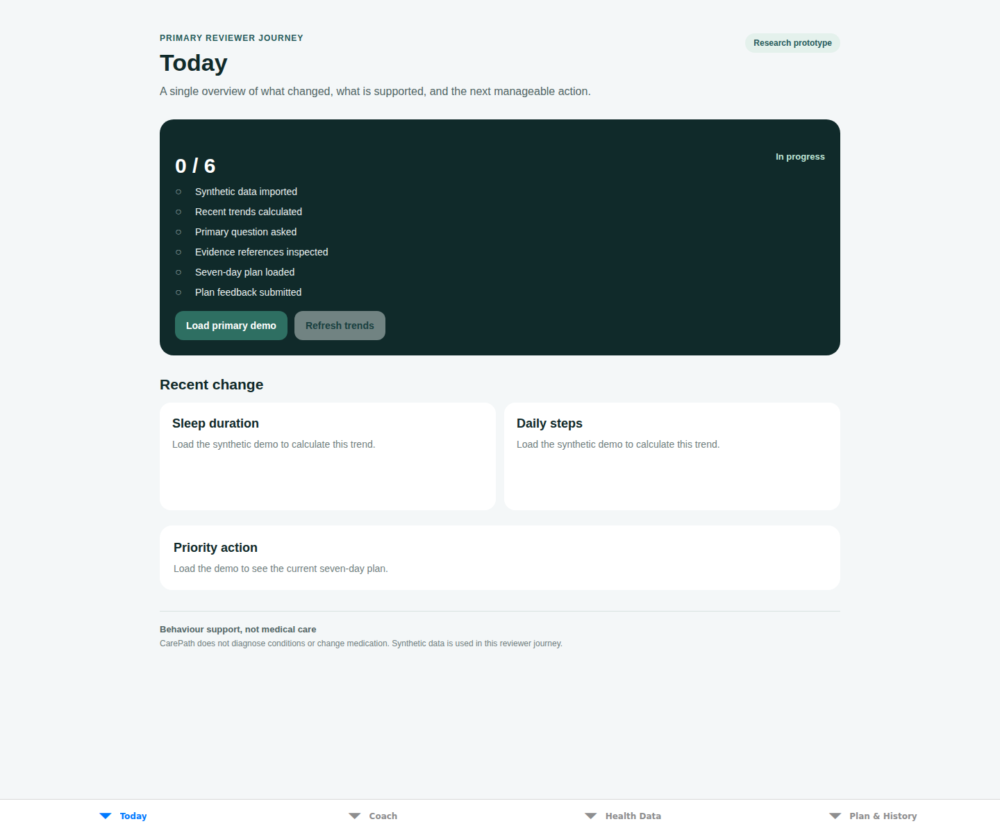

# CP-015 primary mobile journey

CP-015 connects the frozen B primary scenario to the Expo application on top of the backend v0.6 contract. A reviewer can complete the workflow without opening API documentation or manually preparing requests.

## Reviewer path

1. **Today / Health Data — Import**: choose **Load primary demo** or **Import synthetic demo**. The app sends the canonical project JSON package to `POST /records/import`, then loads trends and the active plan.
2. **Health Data — Inspect trends**: review 14-day current-vs-previous-window summaries for sleep duration, resting heart rate, steps, and stress score. The UI labels these as deterministic summaries of synthetic observations, not diagnoses.
3. **Coach — Ask the primary question**: the input is prefilled with “I have felt more tired recently. What changed, and what is a realistic plan for this week?” Before coaching, the application attempts a bounded external-evidence search so the lazily configured evidence index is available to the runtime. A missing index is a controlled degradation and does not require an API console.
4. **Coach — Inspect the verified answer and evidence**: `POST /coach/message` returns the v0.6 structured six-section response. The app renders `structured_response.sources` directly, keeping user-record citations separate from external-guideline citations and exposing exact evidence, source, chunk, and record identifiers when available.
5. **Plan & History — Review plan**: inspect the active seven-day plan through `GET /plans/current`.
6. **Plan & History — Submit feedback**: accept, reject, or complete an action through `POST /plans/{plan_id}/feedback`; the plan is refreshed so the persisted action status is visible immediately.

Today exposes the six-step completion state and current priority action so the reviewer can see progress without leaving the app.

## Frozen synthetic scenario

The packaged demo contains 28 days of four metrics with a known recent change:

- sleep duration: 7.8 h → 6.6 h;
- resting heart rate: 62 bpm → 68 bpm;
- steps: 8,200 → 5,100;
- stress score: 4 → 7.

It also includes a workload/fatigue journal entry, an active goal, and a seven-day plan covering 2026-07-30 through 2026-08-05. All data in this reviewer path is synthetic.

## v0.6 safety and evidence boundary

The mobile client does not construct medical claims or citations itself. It displays the response already produced by the v0.6 backend Composer after Safety Triage, retrieval, planning, and Grounding & Safety verification. Exact source objects originate from `structured_response.sources`.

The UI visibly identifies CarePath as a research prototype and states that it does not diagnose conditions or change medication. If the external evidence index is unavailable, the evidence warm-up fails in a controlled way and `/coach/message` can return the backend's conservative response with explicit uncertainty rather than exposing an exception.

## Automated acceptance evidence

`tests/test_cp015_v06_mobile_journey.py` runs the backend-facing primary journey end to end with a deterministic test evidence index:

`import → four trend comparisons → v0.6 coaching/structured citations → seven-day plan → feedback → refreshed plan → audit replay`.

Mobile tests cover the synthetic scenario, runtime API transport, endpoint sequence, structured-source handling, feedback mapping, and evidence-index degradation.

## Visual acceptance evidence

The repository includes the Expo Web runtime capture produced during CP-015 implementation:

The migrated v0.6 implementation preserves this reviewer journey while replacing the old hard-coded evidence presentation with backend-provided structured citation objects.
