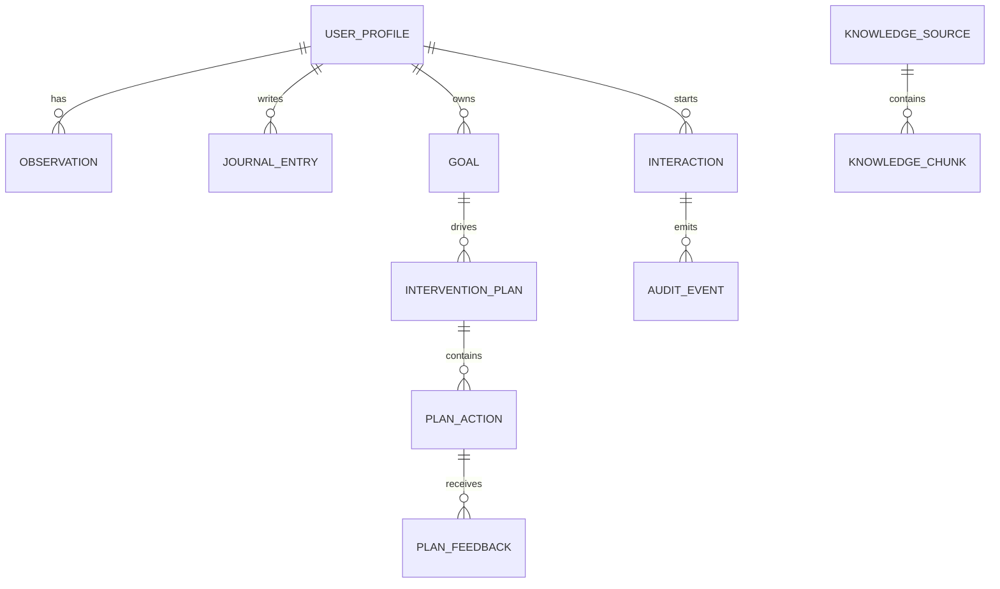

# CarePath Canonical Data Model

`backend.domain` is the canonical application contract boundary. Application, retrieval, API, persistence, evaluation and agent modules must reuse these models and vocabularies instead of defining parallel field names or duplicate entity schemas.

## Contract and naming rules

- Python attributes, JSON keys, REST API fields and CSV headers use the same `snake_case` names.
- Entity IDs are UUIDs unless the contract explicitly defines a string identifier (`source_id`, `chunk_id`).
- Datetimes must include a timezone and are normalized to UTC internally. JSON/API output should use ISO-8601 UTC, preferably `Z` (for example `2026-07-27T00:00:00Z`).
- Date-only values use `YYYY-MM-DD`.
- JSON missing values use `null`. CSV represents an absent scalar as an empty cell; structured JSON fields are serialized as JSON strings when a flat CSV transport is required.
- Enum values are serialized exactly as defined by the canonical enum; callers must not invent aliases.
- Unknown model fields are rejected (`extra="forbid"`) so naming drift fails validation instead of being silently accepted.
- `CarePlan` is an alias of `InterventionPlan`; `ActionFeedback` is an alias of `PlanFeedback`. New code should prefer the canonical names `InterventionPlan` and `PlanFeedback`.

## Core entities

### UserProfile

| Field | Type | Required | Notes |
|---|---|---:|---|
| `user_id` | UUID | yes | canonical user identifier |
| `age_band` | enum | yes | `18-29`, `30-44`, `45-64`, `65+` |
| `preferred_language` | enum | yes | `en`, `zh`, `ja` |
| `timezone` | string | yes | valid IANA timezone, e.g. `Asia/Tokyo` |
| `schedule_constraints` | object/null | no | structured scheduling context |
| `health_goals` | domain[] | yes | unique values from canonical domains |
| `activity_constraints` | string[]/null | no | user-declared practical constraints |
| `coaching_preferences` | object/null | no | non-clinical coaching preferences |
| `consent_flags` | object<boolean> | yes | explicit consent switches |

Canonical domains: `sleep`, `physical_activity`, `stress_mood`, `falls_activity_safety`.

### Observation

| Field | Type | Required | Notes |
|---|---|---:|---|
| `observation_id` | UUID | yes | observation identifier |
| `user_id` | UUID | yes | owner |
| `metric_type` | enum | yes | canonical metric vocabulary below |
| `value_numeric` | number/null | conditional | numeric metrics only |
| `value_boolean` | boolean/null | conditional | fall-event metrics only |
| `unit` | enum/null | yes | must match the metric; event metrics use `null` |
| `observed_at` | datetime | yes | timezone required; normalized to UTC |
| `source_type` | enum | yes | `synthetic_wearable`, `self_report`, `csv`, `fhir` |
| `quality_flag` | enum | yes | `valid`, `missing`, `suspect` |
| `confidence` | number/null | no | optional provenance confidence in `[0, 1]` |
| `metadata` | object/null | no | source-specific provenance only |

#### Metric, unit and range matrix

| `metric_type` | Value field | Unit | Valid-range rule when `quality_flag=valid` |
|---|---|---|---|
| `sleep_duration` | numeric | `hours` | `0 <= value <= 24` |
| `sleep_start_time` | numeric | `minutes_since_midnight` | `0 <= value < 1440` |
| `sleep_end_time` | numeric | `minutes_since_midnight` | `0 <= value < 1440` |
| `sleep_quality` | numeric | `score_1_10` | `1 <= value <= 10` |
| `steps` | numeric | `steps` | non-negative whole number |
| `active_minutes` | numeric | `minutes` | `0 <= value <= 1440` |
| `resting_heart_rate` | numeric | `bpm` | positive |
| `stress_score` | numeric | `score_1_10` | `1 <= value <= 10` |
| `mood_score` | numeric | `score_1_10` | `1 <= value <= 10` |
| `fall_event` | boolean | `null` | boolean value required |
| `near_fall_event` | boolean | `null` | boolean value required |
| `activity_confidence` | numeric | `score_1_10` | `1 <= value <= 10` |

`activity_confidence` is a user-facing 1–10 metric and is distinct from the optional `Observation.confidence` provenance value in `[0, 1]`.

#### Missing and suspect observations

- `quality_flag="missing"`: both value fields must be `null`. The canonical metric/unit pair is still retained for numeric metrics; boolean event metrics retain `unit=null`.
- `quality_flag="suspect"`: the normal value shape and unit are required, but the usual numeric range check is intentionally relaxed so an outlier can be preserved for downstream quality handling.
- `quality_flag="valid"`: type, value shape, metric-specific unit and normal range are all enforced.
- Numeric values must be finite; booleans cannot be supplied through `value_numeric`.

### JournalEntry

`entry_id` UUID, `user_id` UUID, `created_at` UTC datetime, non-empty `text`, `language` (`en`/`zh`/`ja`), optional `user_tags` string array.

### Goal

`goal_id` UUID, `user_id` UUID, `domain`, non-empty `description`, `status`, `created_at` UTC datetime, optional `target_date`.

Goal status vocabulary: `active`, `paused`, `completed`, `cancelled`.

### InterventionPlan

`plan_id`, `user_id`, `goal_id` and `generation_interaction_id` are UUIDs. `version` starts at 1. `start_date` must not be after `end_date`. `supersedes_plan_id` is optional and cannot equal the plan's own ID.

Plan status vocabulary: `draft`, `active`, `completed`, `superseded`, `cancelled`.

### PlanAction

`action_id` UUID, `plan_id` UUID, `domain`, `description`, `frequency`, `difficulty`, `rationale`, `status`.

Difficulty: `low`, `medium`, `high`.

Action status: `proposed`, `accepted`, `rejected`, `modified`, `completed`, `partially_completed`, `not_completed`.

### PlanFeedback

`feedback_id` UUID, `action_id` UUID, `user_id` UUID, `response`, optional `completion_ratio` in `[0, 1]`, optional `reason_text`, `created_at` UTC datetime.

Feedback response: `accepted`, `rejected`, `modified`, `completed`, `partially_completed`, `not_completed`.

### KnowledgeSource and KnowledgeChunk

`KnowledgeSource` records curated evidence provenance: `source_id`, `title`, `organisation`, `url`, optional `published_or_updated_at`, `retrieved_at`, `trust_tier`, `licence_note`.

The system-wide trust vocabulary is:

`T0_POLICY`, `T1_SAFETY`, `T2_GUIDELINE`, `T3_OBSERVATION`, `T4_USER_CONTEXT`, `T5_MODEL_DRAFT`, `T6_UNTRUSTED_EXTERNAL`.

A `KnowledgeSource` represents a curated guideline and therefore must use `T2_GUIDELINE`; other trust classes belong to their corresponding workflow inputs and must not be relabelled as guideline sources.

`KnowledgeChunk` fields: `chunk_id`, `source_id`, optional `section_title`, non-empty `content`, `embedding_model`, and a lowercase 64-character SHA-256 `content_hash` of the stored canonical chunk content.

### Interaction and AuditEvent

`Interaction` captures one auditable user request. Fields: `interaction_id`, `user_id`, `request_text`, `language`, `started_at`, optional `completed_at`, `risk_level`, `final_status`, optional `response_json`.

Risk levels: `routine`, `caution`, `urgent`. Interaction statuses: `in_progress`, `completed`, `blocked`, `failed`.

`AuditEvent` fields: `audit_event_id`, `interaction_id`, positive `sequence_number`, `event_type`, `component`, `input_refs`, `output_summary`, `created_at`.

Audit event types: `safety_decision`, `retrieval`, `tool_call`, `tool_result`, `plan_generated`, `verification`, `plan_revised`, `response_emitted`.

## Persistence contract

Persistence records in `backend/domain/persistence.py` mirror the canonical domain field names. PostgreSQL is the target persistence backend; SQLite may be used for local development. Persistence adapters must not rename domain fields or introduce competing value vocabularies.

## Simplified FHIR mapping

This is a deliberately small interoperability boundary, not full FHIR conformance. Supported resources are exactly `Patient`, `Observation`, `Goal` and `CarePlan`.

| CarePath | FHIR | Simplified field mapping |
|---|---|---|
| `UserProfile` | `Patient` | `user_id -> id`; language -> communication language; age band/timezone/preferences/consent may be represented as project extensions |
| `Observation` | `Observation` | `observation_id -> id`; `user_id -> subject`; `metric_type -> code`; numeric/boolean value + unit -> `value[x]`; `observed_at -> effectiveDateTime`; source/quality/confidence remain provenance extensions |
| `Goal` | `Goal` | `goal_id -> id`; `user_id -> subject`; `description -> description`; status -> lifecycle status; `target_date -> target` |
| `InterventionPlan` + `PlanAction` | `CarePlan` | `plan_id -> id`; `user_id -> subject`; status and dates -> CarePlan status/period; `goal_id -> addresses/goal reference`; actions -> CarePlan activities; version/supersession/generation interaction remain project extensions |

The executable allowlist is defined in `backend/domain/fhir.py` as `FHIR_RESOURCE_TO_MODEL` and `SUPPORTED_FHIR_RESOURCES`. Unsupported FHIR resource types must not be treated as canonical CarePath models.

## CSV, JSON and API examples

- JSON/API use the canonical field names without casing conversion.
- CSV uses the same field names as headers. Arrays/objects are JSON-encoded strings when represented in one CSV cell.
- The minimal single-observation example is `docs/examples/observation.json`.
- The cross-entity longitudinal example is `docs/examples/longitudinal_record.json`.

## ER diagram

The maintained Mermaid source is `docs/diagrams/data-model.mmd`.

