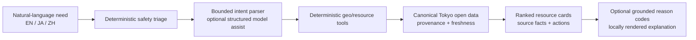

# CarePath Tokyo — Governor's Cup Open Data Hackathon 2026 submission package

This directory is the single submission source for CP-209. It is intentionally narrower than the broader CarePath Core repository and describes only the implemented Tokyo public-resource navigator.

## Submission statement

**CarePath Tokyo turns natural-language public-health/support needs into source-backed Tokyo resources in EN/JA/ZH, using deterministic geospatial search, bounded intent assistance, explicit safety triage and visible provenance—without requiring an account or health-file upload.**

## Package

- `form_content.md` — submission-form draft and claim-safe technical result sentence.
- `open_data.md` — the five representative dataset entries actually used.
- `pitch_script.md` — approximately two-minute First Stage presentation script.
- `demo_script.md` — deterministic <=60 second public-demo journey and optional operation-video shot list.
- `claims_audit.md` — evidence map and explicit prohibited/unsupported claims.
- `links.md` — public demo, repository and official-source links plus logged-out verification boundary.
- `engineering_results.json` — machine-readable CP-207 engineering results used by the submission.
- `screenshots/` — up to three screenshots captured from the public Tokyo route by the CP-209 workflow.
- `CarePath_Tokyo_Governors_Cup_2026.pptx` / `.pdf` — final two-minute presentation materials when generated.

## Architecture used in the pitch

The model layer is never the factual resource authority. Location, radius, filters, ranking, resource facts, provenance and safety decisions remain application/tool controlled.

## Current accepted build

- Public route: `https://carepath-api-8edq.onrender.com/tokyo`
- Accepted merged-main commit: `c33cf0f51f5da402a0db400433719baf506cb942`
- Canonical resource count at CP-208 acceptance: `13,364`
- CP-207: `24/24` cases passed, engineering threshold status `PASS`

These are software-engineering/reproducibility facts, not clinical-effectiveness claims.
